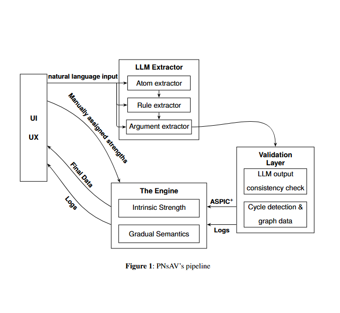

<p align="center">

</p>

<h1 align="center">DOCUMENTAȚIE</h1>
<h2 align="center">PNsAV</h2>

## ❓ Descrierea problemei

Rolul inteligenței artificiale în viața fiecăruia a crescut substanțial în ultimul deceniu, iar implicațiile modelelor de limbaj în domenii precum drept, filosofie și medicină devin semnificative. Fiind modele statistice, LLMurile oferă o capacitate generativă excelentă. Totuși, când le folosim în poziții decizionale, care necesită raționare, acestea devin redundante, expunând mai degrabă soluția probabilă din punct de vedere lingvistic, adesea contrară celei raționale.
## 💾 Descrierea soluției

Pentru a rezolva problema expusă anterior, propunem PNsAV (Probabilistic Neurosymbolic Argument Validation model), un pipeline end-to-end care preia limbaj natural de la utilizator, extrage structurile argumentative și le analizează folosind semantici graduale, pentru a returna utilizatorului un scor reprezentativ corespunzător fiecărui argument, înglobat în graful argumentativ. Extragerea se efectuează printr-o orchestrație de LLMuri constrânse în structura ASPIC$^+$ (bazată pe framework-urile de argumentare abstracte a lui Dung). Acestea sunt apoi organizate într-un semi-weighted argumentation graph (WAG) cu coeficienții calculați după principiile lui Spaans de compunere a "intrinsic strength". Pe acest graf se rulează un algoritm de propagare generic, care descrie valorile finale. Această structură elimină pe cât se poate posibilitatea de halucinare a LLMului, bazându-se pe logică.
## 👥 Publicul țintă

Publicul țintă se poate împărți în 2 grupuri:

1) Cercetători în domeniul logicii și al argumentării, pentru a ușura analiza dezbaterilor, textelor politice și a textelor argumentative
2) Politicieni, avocați, magistrați, filosofi, sau orice persoană care vrea o perspectivă algoritmică asupra unui subiect.
## ⚙️ Funcționalități

* Graful argumentativ - conține toate argumentele și relațiile dintre ele
* Textul analizat - color-coded în culorile argumentelor
* Logs - informații despre rezultatele extragerii și al propagării 
* Încărcarea textului - două modalități de a analiza text
## 🧱 Arhitectura aplicației

### **Module principale**

* **UI/UX** - Interfața prin care utilizatorul interacționează cu motorul logic. Colectează și trimite datele tutoror modulelor.
* **LLM Extractor** - Primind textul pentru analiză de la interfață, acest modul utilizează o orchestrație de 3 LLMuri pentru a extrage structura ASPIC+ a textului, având un model de limbaj pentru atomi, reguli și argumente.
* **Validator** - Validatorul are un rol esențial, acesta asigurând corectitudinea structurii argumentative generate, cât și generarea muchiilor de pe graf (atacuri).
* **Engine** - Motorul logic preia structura ASPIC+ și scorurile date de către utilizator pentru fiecare propoziție și regulă logică, calculează puterea inițială a unui argument, iar apoi rulează un algoritm de propagare până la convergență.

<p align="center">

</p>

### **Tehnologii**

PNsAV folosește Python pentru extragerea structurilor argumentative și validarea acestora, dar C++ este baza motorului de propagare și calcul a coeficienților inițiali, din pricina performanței ridicate. Python este utilizat din cauza legăturii ușoare cu OpenAI API (care furnizează LLM-urile de tip GPT 5.4 folosite) dar și facilitatea construirii unei interfețe video cu Streamlit. Alte biblioteci utile sunt ```ast, json, Pathlib```. Motorul logic este scris în întregime în C++, fără folosirea altor biblioteci externe, în afară de ```pybind11```, pentru legătura cu interfața. 
## 🖥️ Instalare

### 1. Compilarea sursei

Chiar dacă scripturile Python rulează fără compilare, doar prin interpretare, codul C++ trebuie compilat într-un modul pentru a fi utilizat in Python. Folosim un environment `cmake` pentru a converti codul în modul de tip `.pyd` importat direct în scriptul de intrare, scris în Python. Pentru rularea programului se recomandă folosirea variantei 3.13 a limbajului, deoarece API-ul OpenAI nu are încă suport pentru versiuni mai noi.
### 2. Executarea programului fără compilare

Se execută cu Python 3.13 scriptul `src/interface/index.py` după instalarea Streamlit, streamlit-agraph. Modulul motorului se găsește în `src/core/engine`. 
## ‼️ Analiza competiției

Pentru a analiza competiția, am citit literatura de specialitate, unde am identificat multe alternative pentru PNsAV. Totuși, multe dintre acestea prezintă diferențe structurale semnificative care deviază direcția alternativei, nefiind astfel viabilă pentru a concura cu PNsAV. Soluțiile existente folosesc arhitecturi pur neurale (SymbCoT), ori nu au logică probabilistică (Logic-LM). Cea mai apropiată variantă este FAKB, un pipeline asemănător, dar care rămâne teoretic, nu garantează convergență pe orice tip de graf și nu ia în considerare structura internă a argumentelor.
## ❓ De ce am ales aceste tehnologii?

Pentru motorul logic am ales C++ deoarece oferă compatibilitate indiferent de platforma aleasă, performanță și suportă nativ programarea orientată pe obiecte. Python este folosit pentru argument mining și interfață pentru că are acces simplu la biblioteci precum OpenAI și Streamlit. Am ales Streamlit pentru grafică deoarece este o bibliotecă grafică pentru aplicații cu date, producând un web app ușor de găzduit și întreținut.
## 💡 Opinia noastră

Noi credem că AI-ul nu ar trebui să fie un fenomen înspăimântător și analog nici mersul la doctor, în sala de judecată sau discuția într-un cadru politic nu ar trebui să ne provoace frici în legătură cu decizii importante luate de un model lingvistic. Așadar, am creat PNsAV, pentru a combate volatilitatea unui LLM. 

## 🌇 Dezvoltări ulterioare

### Features

* Posibilitatea de a schimba limbajul logic
* Automatizarea calculării coeficienților inițiali
* Pipeline de argument mining profesional
* La deployment, posibilitatea de a selecta propriul model lingvistic
### Deployment

Momentan, PNsAV este în proces de deployment, aplicația urmând să fie publică și accesibilă oricui.
## 📝 Cercetare

Lucrarea ștințiifică aferentă se poate regăsi în `documentation/paper`.
## 📖 Bibliografie

**Alfano, G., Greco, S., La Cava, L., Monea, S. F., & Trubitsyna, I.** (2026). LLM-based Argument Mining meets Argumentation and Description Logics: a Unified Framework for Reasoning about Debates. *arXiv:2603.02858 [cs.AI]*.

**Amgoud, L., & Ben-Naim, J.** (2017). Evaluation of arguments from support relations: Axioms and semantics. *Proceedings of the 26th International Joint Conference on Artificial Intelligence (IJCAI)*.

**Cai, L., Choi, J., & He, J.** (2021). Neural-Symbolic Commonsense Reasoner with Knowledge Graphs. *Proceedings of the Findings of the Association for Computational Linguistics (ACL)*, 2340–2352.

**Caminada, M. W. A., & Gabbay, D. M.** (2009). A Logical Account of Formal Argumentation. *Studia Logica, 93*, 109. https://doi.org/10.1007/s11225-009-9218-x

**Dung, P. M.** (1995). On the acceptability of arguments and its fundamental role in nonmonotonic reasoning, logic programming and n-person games. *Artificial Intelligence, 77*(2), 321–357.

**Golovneva, O., Chen, M., Poff, S., Corredor, M., Zettlemoyer, L., Fazel-Zarandi, M., & Celikyilmaz, A.** (2023). ROSCOE: A suite of metrics for scoring step-by-step reasoning. *Proceedings of the 11th International Conference on Learning Representations (ICLR)*.

**Gupta, N., Lin, K., Roth, D., Lewis, M., & Singh, S.** (2020). Neural Module Networks for Reasoning over Text and Symbolic Data. *Proceedings of the 8th International Conference on Learning Representations (ICLR)*.

**Hunter, A., & Thimm, M.** (2014). Probabilistic Argumentation with Epistemic Extensions and Incomplete Information. *arXiv:1405.3376 [cs.AI]*.

**Manhaeve, R., Dumančić, S., Kimmig, A., Demeester, T., & De Raedt, L.** (2021). Neural probabilistic logic programming in DeepProbLog. *Artificial Intelligence, 298*, 103504.

**Mao, J., Gan, C., Kohli, P., Tenenbaum, J. B., & Goel, J.** (2019). The Neuro-Symbolic Concept Learner: Interpreting Scenes, Words, and Sentences from Natural Supervision. *Proceedings of the 7th International Conference on Learning Representations (ICLR)*.

**Miller, N.** (2026). A Modular LLM Approach to Argument Extraction in Philosophical Texts. *Masters Theses, 1170*.

**Mossakowski, T., & Neuhaus, F.** (2018). Modular Semantics and Characteristics for Bipolar Weighted Argumentation Graphs. *arXiv preprint arXiv:1807.06685*.

**Pan, L., Albalak, A., Wang, X., & Wang, W. Y.** (2023). LOGIC-LM: Empowering Large Language Models with Symbolic Solvers for Faithful Logical Reasoning. *Findings of the Association for Computational Linguistics: EMNLP 2023*.

**Potyka, N.** (2018). Continuous Dynamical Systems for Weighted Bipolar Argumentation. *Proceedings of the 16th International Conference on Principles of Knowledge Representation and Reasoning (KR)*.

**Potyka, N.** (2019). Extending Modular Semantics for Bipolar Weighted Argumentation. *Proceedings of the 18th International Conference on Autonomous Agents and MultiAgent Systems (AAMAS)*, 1722–1730.

**Prakken, H.** (2010). An abstract framework for argumentation with structured arguments. *Argument & Computation*.

**Pryor, C., Interian, C., & de Raedt, L.** (2022). Neuro-Symbolic Relational Reasoning Systems: A Survey. *arXiv preprint arXiv:2205.11904*.

**Spaans, J. P.** (2021). Intrinsic Argument Strength in Structured Argumentation: a Principled Approach. *arXiv preprint arXiv:2109.00318*.

**Tian, J., Zhang, X., & Wang, H.** (2022). Weakly Supervised Neural Symbolic Learning for Cognitive Tasks. *Proceedings of the 31st International Joint Conference on Artificial Intelligence (IJCAI)*.

**Xu, J., Fei, H., Pan, L., Liu, Q., Lee, M. L., & Hsu, W.** (2024). Faithful Logical Reasoning via Symbolic Chain-of-Thought. *Proceedings of the 62nd Annual Meeting of the Association for Computational Linguistics (Volume 1: Long Papers)*.

